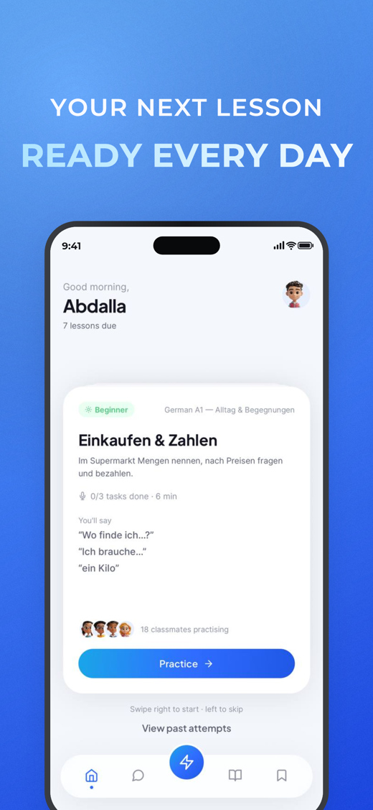

# flowent-shotkit

Turn raw app screenshots into store-ready **App Store / Google Play** screenshot kits —
a **deterministic renderer** plus an optional **AI director** for the copy.

One TypeScript engine, runs in Node (CLI/CI) and in the browser. No backend.

## Why

A store screenshot is a composition of known layers (background → device → screen →
status bar → headline). Once each layer is generated programmatically, producing dozens
of polished, on-brand slides is a pipeline, not a design sprint. See
[`docs/ENGINE.md`](./docs/ENGINE.md) for the full method and
[`docs/REUSABILITY.md`](./docs/REUSABILITY.md) for the architecture.

## Quick start

```bash
npm install
npm run render -- --config shotkit.config.json --out out
```

Outputs, organized by store:

```
out/manifest.json
out/app-store/apple-iphone-69/01-home.png   (1290×2796)
out/app-store/apple-ipad-13/01-home.png     (2064×2752)
out/google-play/play-phone/01-home.png      (1080×1920)
```

## Config

```jsonc
{
  "storeIds": ["appstore-iphone-69", "appstore-ipad-13", "play-phone"],
  "theme": {
    "fontFamily": "Montserrat", "weightLine1": 600, "weightLine2": 700,
    "headlineColor": "#F8FAFF", "gradient": ["#AEE4FF", "#F4FBFF"],
    "background": { "kind": "synthetic", "from": "#5CA8FF", "to": "#1C46DE", "glow": "rgba(150,200,255,0.30)", "grain": 7 }
  },
  "slides": [
    { "id": "01-home", "screenshot": "assets/examples/home.png", "headline": { "line1": "YOUR NEXT LESSON", "line2": "READY EVERY DAY" } }
  ]
}
```

## Programmatic

```ts
import { renderProject, allTargets, DeterministicDirector } from 'flowent-shotkit'
```

## The AI Director (optional)

The renderer is 100% local. The **Director** is the only AI piece: it reads screenshots
and writes the headline set + order + theme into the config. It runs once per project,
never per render. Ships with a no-API `DeterministicDirector` and a BYOK `LlmDirector`
interface. See `docs/REUSABILITY.md` §12.

## Layout

```
src/
  detect? (roadmap)   targets.ts    background.ts   device.ts
  statusbar.ts        headline.ts   compose.ts      imgproc.ts
  render-target.ts    types.ts      cli.ts          index.ts
  node/canvas-target.ts             director/*
assets/fonts          assets/examples
```

## Scripts

- `npm run render` — render a config to PNGs + manifest
- `npm run typecheck` — `tsc --noEmit`
- `npm test` — unit tests (Vitest)
- `npm run build` — bundle to `dist/` (tsup)

MIT.

## Example output

Generated by `npm run render` (synthetic device, Brand Blue theme):



## Web Studio

A browser UI that drives this engine entirely client-side (no backend):
upload screenshots, edit headlines, auto-generate on-brand headlines, pick a
theme + stores, see a live preview, and export the kit as a ZIP.

```bash
cd studio
npm install
npm run dev      # open the printed http://localhost:5173
npm run build    # production bundle in studio/dist
```

Theme presets: Brand Blue, Iridescent, Teal, Clean Light. The "Auto-headlines"
button runs the deterministic Director offline; wire a vision model (BYOK) for
full AI writing — see `docs/REUSABILITY.md` §12.
